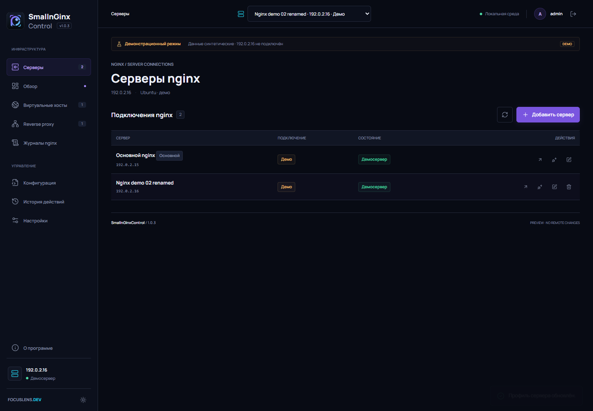

# SmallnGinxControl v1.0.3

Русскоязычная self-hosted панель для управления одним или несколькими nginx-серверами. Django/Waitress обслуживают интерфейс и API; локальные и удалённые серверы управляются через nginx CLI или проверенный SSH. Статика, шрифты и графики поставляются локально, Docker и Node.js на production-сервере не нужны.

**Текущая версия: v1.0.3.** Панель для nginx с HTTPS production-доступом, SSH-профилями, метриками, журналами и управлением virtual hosts.

## Кратко

- Управление virtual hosts и reverse proxy, аудит конфигураций nginx с проверкой и rollback.
- Dashboard с сетевыми, системными и disk-метриками; TOP-5 трафика и per-host журналы.
- SSH-профили с проверкой fingerprint, паролями, ключами и агентом.
- TOTP 2FA, Secure sessions, CSRF и ограничение попыток входа.
- Production HTTPS через nginx на `0.0.0.0:7444`; backend Waitress закрыт на `127.0.0.1:7445`.
- Self-signed сертификат создаётся автоматически; в настройках можно скачать публичную часть, перевыпустить или заменить пару PEM.
- Распространяется бесплатно по MIT License; сведения о проекте, авторе и возможных отдельных услугах — в меню «О программе».

Полное руководство: [возможности и работа с панелью](doc/help.md) · [установка и deployment](doc/deployment.md).

## Скриншоты




## Быстрый запуск

Для локального безопасного демо на Windows:

```powershell
git clone https://github.com/DgekStr/SmallnGinxControl.git
Set-Location SmallnGinxControl
git checkout main
python -m venv .venv
.\.venv\Scripts\python.exe -m pip install -r requirements.txt
.\.venv\Scripts\python.exe bootstrap.py
.\.venv\Scripts\python.exe serve.py
```

Откройте http://127.0.0.1:7444. Демо-учётная запись: `admin / 12345`; не используйте её в production. Демо привязано к loopback и не меняет системный nginx.

### Доступ и адреса привязки

В локальном demo Waitress по умолчанию слушает только `127.0.0.1:7444` (`SNC_BIND=127.0.0.1`, `SNC_PORT=7444`). Эти переменные можно задать явно перед запуском:

```powershell
$env:SNC_BIND = '127.0.0.1'
$env:SNC_PORT = '7444'
python serve.py
```

Чтобы открыть demo с другого компьютера, не меняйте bind на `0.0.0.0`: запуск demo на сетевом интерфейсе блокируется намеренно, поскольку demo использует временный пароль. Подключитесь SSH-туннелем с клиентского компьютера:

```sh
ssh -N -L 7444:127.0.0.1:7444 USER@SERVER_IP
```

Оставьте SSH-сеанс открытым и на клиенте перейдите на http://127.0.0.1:7444.

В production installer настраивает nginx принимать HTTPS на `0.0.0.0:7444`, а Waitress оставляет на `127.0.0.1:7445`. `0.0.0.0` означает «слушать все интерфейсы» и используется только в конфигурации сервера; **не открывайте** `https://0.0.0.0:7444` в браузере. Подключайтесь так:

- Из LAN: `https://SERVER_IP:7444` (например, `https://192.168.0.43:7444`). Разрешите TCP/7444 только доверенным сетям в firewall; installer firewall не меняет.
- Через SSH-туннель: `ssh -N -L 7444:127.0.0.1:7444 USER@SERVER_IP`, затем `https://localhost:7444`.

Первый вход использует локальный self-signed сертификат, поэтому браузер покажет предупреждение. Для первоначального входа подтвердите исключение браузера либо заранее установите сертификат из доверенного канала. После входа скачайте публичный сертификат в `Настройки → HTTPS панели` и добавьте его в доверенные на клиентском устройстве. Приватный ключ не скачивается и остаётся на сервере. Подробности: [HTTPS и deployment](doc/deployment.md#https-доступ).

Для воспроизводимой установки release `v1.0.3` используйте [deploy/install.sh](deploy/install.sh) или [инструкцию](doc/deployment.md). Тег — неизменяемый snapshot; для установки текущей разработки задайте `SNC_RELEASE_TAG=main`. Незакоммиченные файлы рабочего дерева в Git clone не попадают. Установщик создаёт production state вне репозитория и запрашивает пароль администратора только в терминале.

Production требует Python 3.12+ и systemd; nginx installer установит автоматически на Debian/Ubuntu. Для частного IP self-signed сертификат не будет автоматически доверенным браузером; в Settings его можно перевыпустить или заменить сертификатом доверенного CA.


## Документы

- [Release v1.0.3](doc/release-v1.0.3.md)
- [Release v1.0.3 · HTML](doc/release-v1.0.3.html)
- [Release v1.0.3 · HTML](doc/release-v1.0.3.html)
- [Полное руководство](doc/help.md)
- [Сравнение GitHub-решений](doc/research-2026-10-04.md)
- [Развёртывание из git clone](doc/deployment.md)
- [Roadmap и readiness](doc/roadmap-2026-10-04.md)

Панель предназначена для доверенного администратора. Произвольное редактирование nginx-конфигов с root-процессом даёт root-эквивалентные возможности. Waitress backend остаётся на loopback; разрешайте TLS-порт nginx `7444` только доверенным сетям, используйте сильный пароль и доверенный сертификат. Если прямой LAN-доступ не нужен, используйте SSH-туннель.