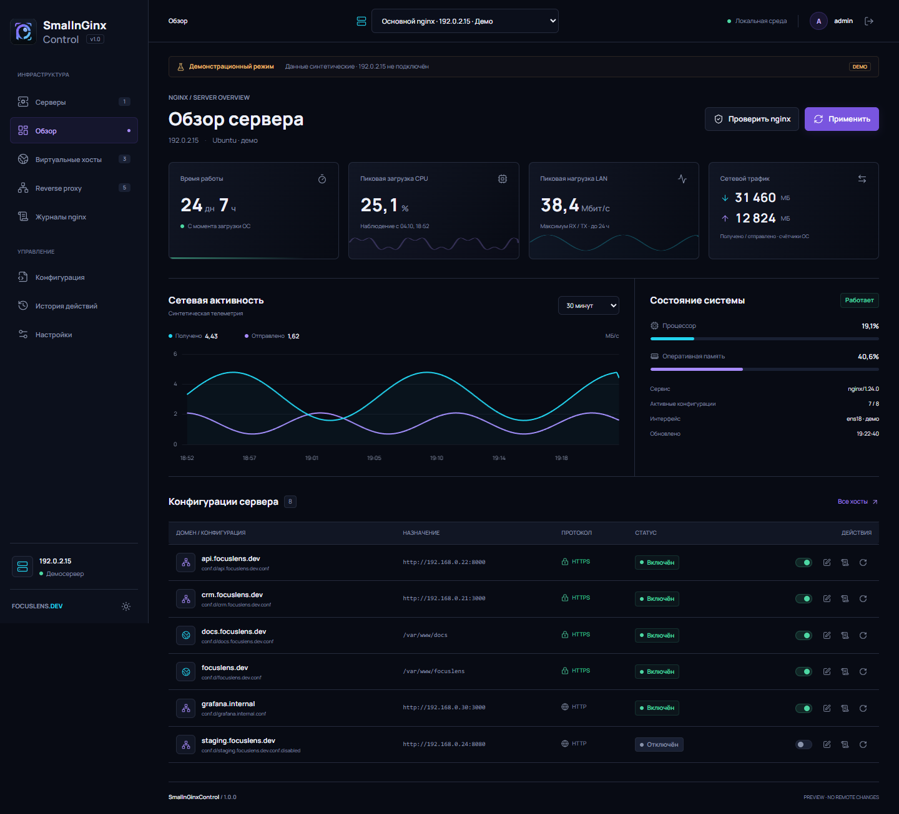

# SmallnGinxControl v1.0

Русскоязычная self-hosted панель для управления одним или несколькими nginx-серверами. Django/Waitress обслуживают интерфейс и API; локальные и удалённые серверы управляются через nginx CLI или проверенный SSH. Статика, шрифты и графики поставляются локально, Docker и Node.js на production-сервере не нужны.

**Актуальный релиз: v1.0.** Русский интерфейс, светлая и тёмная темы, адаптивная навигация. В релиз входят управление vhost/reverse proxy, конфигурациями, журналами, метриками, профилями SSH и обратимый maintenance-режим для отключённого proxy.



Другие снимки: [reverse proxy в обслуживании](doc/images/proxies-maintenance.png), [список серверов](doc/images/servers.png), [мобильный интерфейс](doc/images/servers-mobile.png).

## Быстрый запуск

Для локального безопасного демо на Windows:

```powershell
git clone https://github.com/DgekStr/SmallnGinxControl.git
Set-Location SmallnGinxControl
git checkout v1.0
python -m venv .venv
.\.venv\Scripts\python.exe -m pip install -r requirements.txt
.\.venv\Scripts\python.exe bootstrap.py
.\.venv\Scripts\python.exe serve.py
```

Откройте http://127.0.0.1:7444. Демо-учётная запись: `admin / 12345`; не используйте её в production. Демо привязано к loopback и не меняет системный nginx.

Для установки Linux-сервиса из опубликованного git-тега используйте [deploy/install.sh](deploy/install.sh) или пошаговую [инструкцию](doc/deployment.md). Установщик запускается от root, клонирует тег v1.0, создаёт production state вне репозитория и запрашивает пароль администратора только в терминале. По умолчанию приложение доступно через SSH-туннель, без открытого HTTP-порта.

Production требует Python 3.12+, systemd и nginx. Допускается отдельный TLS reverse-proxy перед loopback upstream. Для частного IP self-signed сертификат не будет автоматически доверенным браузером; для публично доверенного TLS используйте DNS-имя и сертификат от доверенного CA.

## Возможности

- Раздел «Серверы»: добавление, редактирование, проверка соединения и удаление профилей; постоянный селектор выбранного nginx.
- Независимые хосты, конфиги, журналы, история и метрики каждого сервера; выбор сохраняется отдельно для вкладки.
- SSH по паролю, приватному ключу или SSH-агенту; проверка закреплённого SHA256-отпечатка и шифрование сохранённого секрета.
- Хешированные пароли, сессии Django, CSRF, ограничение попыток входа, POST-выход.
- Uptime дней/часов, пики CPU и LAN, текущая CPU/RAM, RX/TX в МБ и скорости в МБ/с.
- Хосты и reverse proxy, поиск домена/пути/upstream, фильтры состояния.
- Добавление HTTP-сайта или HTTP(S)-upstream, отдельные журналы.
- Включение/отключение стандартных sites-available/sites-enabled и conf.d/*.conf; reverse proxy при отключении переходит в режим обслуживания с `maitenance.html`.
- Редактор исходных конфигураций, сложных location/upstream/TLS и nginx.conf без перегенерации существующих файлов.
- Crossplane, настоящий `nginx -t` в рабочем режиме, reload и отдельный подтверждаемый restart.
- Резервная копия, блокировка параллельных операций, проверка revision, атомарная запись и откат при ошибке проверки/reload.
- Отключённый reverse proxy остаётся активным vhost и показывает `/var/www/html/maitenance.html` с HTTP 503; включение восстанавливает исходную конфигурацию байт-в-байт.
- Последние 50/150/500 строк журналов, автообновление, скачивание фрагмента.
- Аудит успешных и ошибочных операций, смена пароля, мобильная навигация, две темы.

## Подключение серверов

Открыть **Серверы → Добавить сервер**, указать название, IP/DNS, тип SSH, порт, пользователя и способ авторизации. Для ключа указывается путь на машине, где запущена панель, а не на удалённом nginx. Пароль или пароль ключа вводить только в интерфейсе; не отправлять в чат.

Получить отпечаток кнопкой справа от поля SHA256 и сверить его по доверенному каналу с SSH host key сервера. Получение отпечатка само по себе не удостоверяет сервер. После проверки отметить доверие ключу и сохранить профиль. При несовпадении сохранённого ключа соединение блокируется до явного изменения профиля.

На удалённой Ubuntu нужны Python 3.10+, `/usr/sbin/nginx` и `/usr/bin/systemctl`, права на конфиги/журналы и reload/restart. Отдельные пакеты Python или постоянный агент на ней не устанавливаются. Код ограниченного исполнителя передаётся через SSH и выполняется без сохранения исходника. При управляющих операциях создаются блокировка и резервные копии в `/var/lib/smallnginxcontrol-ssh`.

Секреты хранятся в БД зашифрованными Fernet с ключом, производным от Django SECRET_KEY, и никогда не возвращаются API. Для восстановления SSH-подключений нужны и БД, и прежний SECRET_KEY. Пустой пароль при редактировании сохраняет старый; смена адреса/порта/пользователя требует повторного ввода SSH-пароля. Смена назначения профиля очищает его прежние метрики.

Режим задаётся для каждого профиля: **Демо** не подключается к сети, **SSH** выполняет реальные операции на выбранной машине даже при локальном запуске панели. После сохранения SSH-профиля запускается фоновый сбор метрик. Ошибка одного сервера не подменяется данными другого. Работает до четырёх сборщиков одновременно; после ошибки опрос повторяется примерно через 30 секунд, номинальный интервал здорового сервера — 5 секунд.

Удаление подключения не удаляет nginx, удалённые конфиги и резервные копии. Основной профиль не удаляется; его режим определяется первоначальной настройкой панели. Перед сменой сервера интерфейс подтверждает потерю несохранённых правок. API привязывает запросы к `server` и версии `server_revision`, а UI отвергает запоздалые ответы предыдущего сервера.

## Семантика и границы

Единица управления — **файл**, не отдельный server-блок. Если файл содержит несколько сайтов, действия затрагивают все его блоки; интерфейс показывает количество. Файл с proxy/fastcgi/grpc/uwsgi/scgi относится к reverse proxy. Отдельный хост nginx нельзя перезапустить: действие строки вызывает общий reload.

В Linux дополнительно обнаруживаются файлы графа include nginx.conf. Внешние файлы за пределами SNC_NGINX_ROOT показываются предупреждениями, но не редактируются. Для нестандартных include переключение требует редактора nginx.conf. Реальную структуру сервера нужно обследовать перед деплоем.

При отключении стандартного reverse proxy панель сохраняет исходный файл вне nginx root в защищённом state-каталоге и оставляет vhost активным. UI показывает состояние «Обслуживание». Запросы получают `503` с содержимым `/var/www/html/maitenance.html`. При включении исходный файл восстанавливается байт-в-байт. Обычные статические хосты сохраняют полное отключение. Если reverse proxy уже включает `maintenance_all.conf`, используется его error handler; иначе добавляется внутренний обработчик страницы обслуживания. Нестандартные include требуют ручного редактирования.

Существующая TLS-конфигурация сохраняется. Форма создаёт HTTP-хост; Let's Encrypt и отдельный мастер сертификатов не реализованы. SSL задаётся в редакторе с существующими сертификатами. HTTPS-бейдж означает listen ssl, не проверку срока сертификата.

Журналы читаются только из SNC_LOG_ROOT, максимум 128 КБ на файл за запрос. Syslog, динамические имена и внешние пути не читаются. При наследуемом журнале нужно выбрать общий журнал.

Пики — измерения раз в 5 секунд за последние 24 часа, не за всё время работы. МБ — байты / 1 000 000 из счётчиков ОС; возможен сброс при перезапуске интерфейса/ОС. Для точной LAN-метрики выбрать физический интерфейс через SNC_INTERFACE.

В демо Crossplane проверяет синтаксис, системные команды не запускаются, метрики синтетические. В рабочем режиме активные конфиги проверяет nginx -t; отключённый конфиг полностью проверяется при включении.

## Проверки и ресурсы

```powershell
.\.venv\Scripts\python.exe manage.py test panel
.\.venv\Scripts\python.exe manage.py check
node --check static/app.js
npm ci
npm run assets
npm run test:e2e
```

В Windows тесты используют установленный Google Chrome; браузер можно выбрать через SNC_TEST_BROWSER. В Linux предварительно выполнить `npx playwright install chromium`. Тесты запускаются в отдельной локальной демосреде; рабочее демо не меняют. Готовые ресурсы находятся в static/vendor, Node.js нужен только для их обновления и тестов. Изображение static/brand.png взято из предоставленного проекта CRM/focuslens-site/assets/logo_dark_tile.png. Лицензии библиотек сохранены рядом с ресурсами.

Проверки релиза v1.0: backend-тесты Django, Playwright в Chrome, `manage.py check`, `node --check static/app.js`. Production-приёмка выполнена на отдельном Ubuntu-хосте: systemd active, HTTPS reverse-proxy отвечает, nginx syntax test успешен, API требует вход. Maintenance renderer проверен на production virtual host в изолированном тесте, без переключения действующего сайта. Подробности и ограничения: [release notes](doc/release-v1.0.md), [HTML-описание](doc/release-v1.0.html), [production deployment](doc/deployment.md).

## Документы

- [Сравнение GitHub-решений](doc/research-2026-10-04.md)
- [Развёртывание из git clone](doc/deployment.md)
- [Release v1.0](doc/release-v1.0.md)
- [Roadmap и readiness](doc/roadmap-2026-10-04.md)

Панель предназначена для доверенного администратора. Произвольное редактирование nginx-конфигов с root-процессом даёт root-эквивалентные возможности. Не публиковать в Интернет без HTTPS, сильного пароля и сетевого ограничения. Предпочтительный старт: loopback + SSH-туннель.